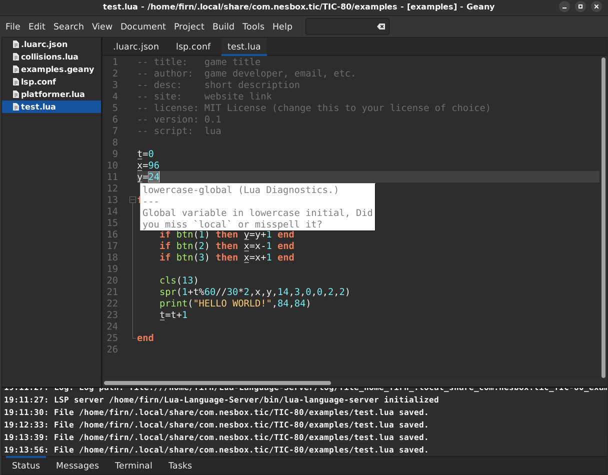
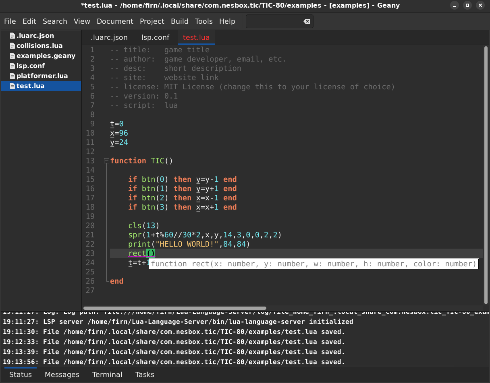
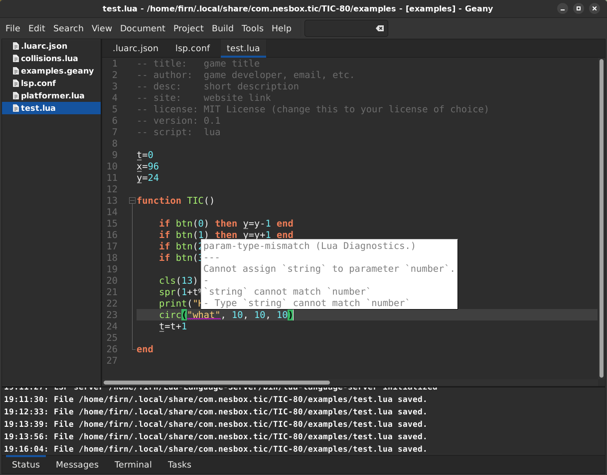

# TIC-80 Library for the Lua Language Server

A [TIC-80](https://tic80.com/) library for the [Lua Language Server](https://luals.github.io/) which provides code completion, parameter hints, etc.

To install, run the following command inside the **meta/3rd/** directory:

```sh
git clone https://codeberg.org/firns/tic80-lua-language-server-stubs.git tic80
```

Then update your .luarc.json with the following:

```json
{
  "workspace.library": [
    "${3rd}/tic80/library"
  ],
  "runtime.version": "Lua 5.3"
}
```

The tic.lua file with the definitions is in the library folder.


style suggestions
----------------------------------


----------------------------------

parameter hints
----------------------------------


----------------------------------

catching type mismatches
----------------------------------


----------------------------------
